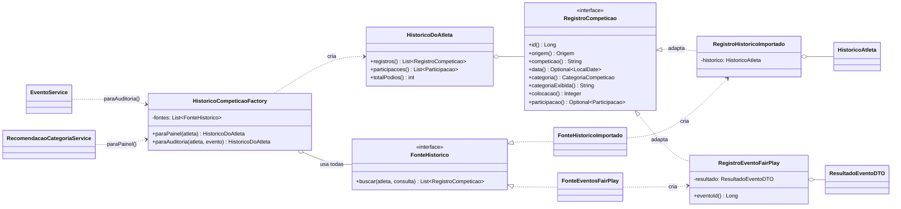
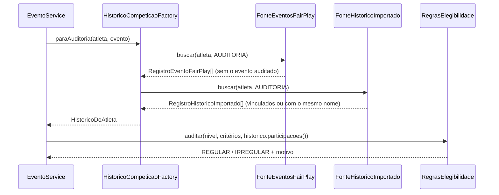

# Padrões de projeto no histórico de competições: Factory + Adapter

Pacote: `backend/src/main/java/br/com/uff/fairplay/service/historico`

## Problema

O histórico de competições de um atleta vem de mais de uma origem, cada uma num formato:

| Origem | Onde está | Categoria | Data |
|---|---|---|---|
| Histórico importado (competições externas, ex.: WodEngage) | tabela `historico_atletas` | texto ("Rx", "Intermediário", "Outros") | não tem |
| Eventos do próprio FairPlay | colocação lançada na inscrição (`inscricoes_evento`) | enum `CategoriaCompeticao` | data do evento |

Duas partes do sistema usam esse histórico: a **auditoria de elegibilidade** das inscrições e o **painel do
atleta** (histórico, pódios e categoria recomendada). Antes, cada uma convertia as duas origens por conta
própria, com código duplicado em `EventoService` e em `RecomendacaoCategoriaService`. Acrescentar uma origem
nova exigiria alterar as duas classes, e as regras de categoria ficavam acopladas aos formatos das origens.

## Solução

Dois padrões trabalhando juntos:

- **Adapter (wrapper)**: a interface `RegistroCompeticao` define uma visão única de um resultado de
  competição. `RegistroHistoricoImportado` e `RegistroEventoFairPlay` "embrulham" os objetos de cada origem
  (`HistoricoAtleta` e `ResultadoEventoDTO`) e os adaptam a essa interface, inclusive convertendo a categoria
  em texto para o enum usado pelas regras.
- **Factory (Simple Factory)**: `HistoricoCompeticaoFactory` monta e devolve o histórico do atleta
  (`HistoricoDoAtleta`) já formado pelos adapters. Quem usa o histórico só pede à factory
  (`paraAuditoria` ou `paraPainel`), sem conhecer as origens nem as consultas ao banco.

Cada origem é uma **fonte** (`FonteHistorico`) registrada como componente do Spring. A factory recebe
todas as fontes por injeção de dependência, na ordem definida por `@Order`. Assim, **uma origem nova é
apenas uma classe nova**: nem a factory nem as regras precisam mudar (princípio aberto/fechado).

## Diagrama de classes

## Fluxo da auditoria de uma inscrição

## Classes

| Classe | Papel no padrão |
|---|---|
| `RegistroCompeticao` | Interface-alvo do **Adapter**: a visão única de um resultado |
| `RegistroHistoricoImportado` | Adapter do histórico importado (`HistoricoAtleta`) |
| `RegistroEventoFairPlay` | Adapter da colocação num evento do FairPlay (`ResultadoEventoDTO`) |
| `Origem` | De onde veio o resultado (mostrado no painel) |
| `FonteHistorico` | Contrato de uma origem de resultados |
| `FonteHistoricoImportado`, `FonteEventosFairPlay` | Uma fonte por origem; criam os adapters |
| `ConsultaHistorico` | Finalidade da consulta (painel ou auditoria) e evento auditado |
| `HistoricoCompeticaoFactory` | **Factory**: reúne as fontes e devolve o histórico pronto |
| `HistoricoDoAtleta` | O histórico montado: registros, participações e pódios |

## Alternativas consideradas

- **Manter a conversão em cada serviço** (como era): mais simples, mas duplica código e espalha o
  conhecimento dos formatos das origens pelas regras de negócio.
- **Factory Method (GoF)**: exigiria uma hierarquia de criadores (uma subclasse por origem sobrescrevendo o
  método de criação). A combinação de *Simple Factory* com fontes injetadas pelo Spring alcança a mesma
  extensibilidade com menos classes, aproveitando a injeção de dependência do framework.
- **Importar o histórico pelo próprio sistema** (hoje feito por scripts Python): fica como trabalho futuro.
  Um leitor por formato de arquivo poderia devolver os mesmos `RegistroCompeticao`, reaproveitando o Adapter.

## Como foi verificado

- Testes unitários (`backend/src/test/java/.../service/historico`): conversão feita por cada adapter,
  ordem das fontes, filtros de painel e auditoria, contagem de pódios e inclusão de uma fonte nova sem
  alterar a factory.
- A refatoração não mudou o comportamento: o painel, a auditoria e a reauditoria de um cenário com
  histórico importado e resultado de evento deram exatamente o mesmo resultado antes e depois.
- Os testes de ponta a ponta (`e2e/`) continuaram passando.

## Rascunho para a monografia

> Para consolidar o histórico de competições dos atletas, que provém de fontes com formatos distintos
> (resultados importados de competições externas e colocações registradas nos eventos do próprio
> FairPlay), foram aplicados os padrões de projeto *Adapter* e *Factory*. A interface
> `RegistroCompeticao` estabelece uma representação comum para um resultado de competição, e cada origem
> possui um adaptador que converte o seu formato para essa representação, incluindo a normalização das
> categorias. A classe `HistoricoCompeticaoFactory` centraliza a criação do histórico de um atleta,
> reunindo os registros de todas as fontes disponíveis, de modo que os componentes que aplicam as regras de
> categoria (a auditoria de elegibilidade e a recomendação de categoria) dependem apenas da abstração e não
> das origens dos dados. As fontes são registradas por meio da injeção de dependências do Spring, o que
> permite incluir uma nova origem de resultados apenas com a criação de uma nova classe, sem modificar a
> fábrica nem as regras de negócio, em conformidade com o princípio aberto/fechado. Antes da refatoração,
> essa conversão estava duplicada em dois serviços distintos.
